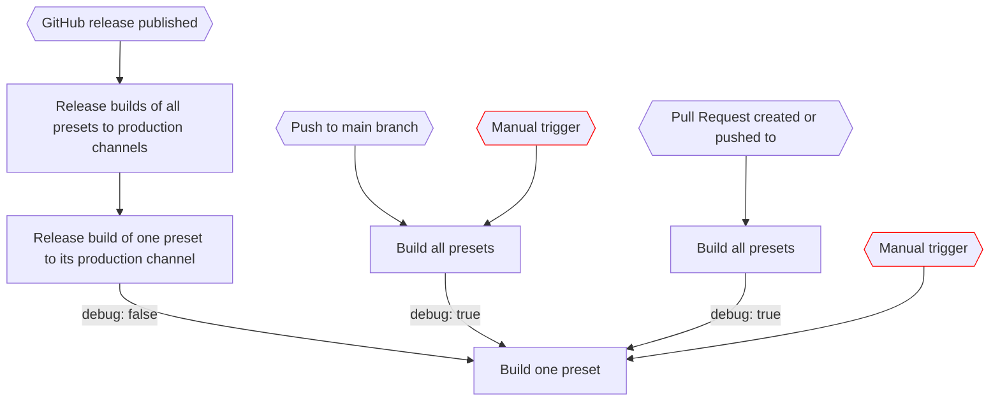

# Godot 4 Project Template

## GitHub Action Workflows

### Intentions and processes

- We want to be able to test builds before merging code changes to `main`
  - We generate downloadable artifacts when creating a PR
  - We generate further artifacts for further changes in the PR
- We want to be able to test builds after merging code changes to `main`
  - We this ability call this 'QA'
  - We generate downloadable artifacts after merging to `main`, with debug mode on
  - We tag commits to `main` with the 'QA' build job number, so we are able to reference a commit back to a specific 'QA' build job and its specific artifacts
- We want to be able to release the game from specific commits on `main` we are happy with
  1. We manually publish a GitHub release with a new version number
     - This version number will be publicly visible
     - The version number progression does not necessarily follow semantic versioning
  1. We generate artifacts, with debug mode off
  1. We upload the artifacts to Itch.io
  1. We tag the commit used to create the release with the 'Release' build job number, so we are able to reference a commit back to a specific 'Release' build job and its specific artifacts

### Diagram

